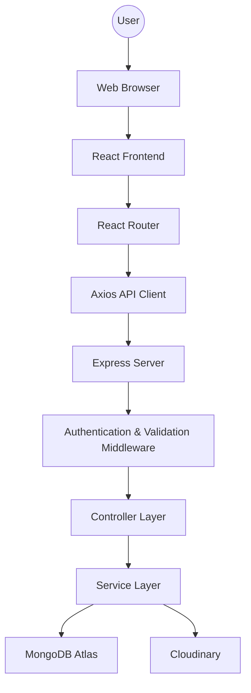

## High-Level Architecture

# sequenceDiagram

User->>React: Click Create Task

React->>Express: POST /tasks

Express->>Middleware: Authenticate

Middleware->>Controller: Valid Request

Controller->>Service: createTask()

Service->>Model: Save Task

Model->>MongoDB: Insert

MongoDB-->>Model: Success

Model-->>Service

Service-->>Controller

Controller-->>React

React-->>User: Success Toast

# Final Backend Architecture
Express
│
Authentication
│
Middleware
│
Routes
│
Controllers
│
Services
│
Models
│
MongoDB Atlas

# SprintHub Roadmap

Project Proposal ✅

↓

Project Charter ✅

↓

SRS ✅

↓

System Design (High-Level) ✅

↓

Database Design ← NEXT

↓

API Design

↓

Backend Folder Structure

↓

Implementation

